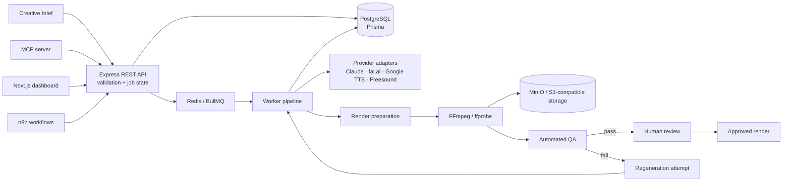

# AI Content Production Pipeline

A TypeScript/Node monorepo for turning a creative brief into short-form video in **9:16 or 16:9**, with asynchronous generation, deterministic FFmpeg rendering, automated QA, and human review.

> **Public-repository scope:** The core API, worker pipeline, fixture-based rendering and QA path, MCP server/client path, and review dashboard are implemented. Provider adapters and n8n workflow definitions are included, but this repository is **not** a public hosted service. The authored n8n workflows have not been live-imported and executed here. Google Drive delivery and pgvector/RAG are not implemented.

This is a portfolio implementation. Provider adapters and workflow definitions should not be read as evidence of a continuously running production deployment.

## What I built

The system separates workflow orchestration from execution, persistence, review, and external integrations. A request enters through the API, work is queued through BullMQ, the worker pipeline generates and assembles assets, FFmpeg produces the final render, QA decides whether the output is acceptable, and human review remains an explicit approval boundary.

## Architecture



**Boundary:** the dashboard, MCP server, and n8n workflows act as clients of the REST API. They do not independently mutate the database or queue.

## Implementation and verification status

| Area | Current status |
|---|---|
| REST API | Express + TypeScript + Zod routes for creating, listing, inspecting, reviewing, and regenerating jobs. |
| Persistence | PostgreSQL/Prisma models for jobs, scenes, assets, reviews, attempts, and cost events. |
| Background work | BullMQ workers for script, scene planning, image, TTS, music, render preparation, and rendering. |
| Providers | Adapters for Claude, fal.ai, Google Cloud TTS, and Freesound are present. Provider-backed output depends on valid credentials and provider availability. |
| Rendering | FFmpeg pipeline supports portrait/landscape output, captions, narration, and music. Fixture-based render smoke tests are available. |
| QA | Output-quality gates are separate from BullMQ transport retries. Validator feedback is threaded into regeneration attempts and attempts are persisted. |
| MCP | A real MCP server exposes six job/review tools and calls the REST API. Its smoke test exercises the API lifecycle; it does not prove a complete provider-backed generation run. |
| Dashboard | Next.js review UI for jobs, scenes/assets, renders, QA/attempt history, costs, and review/regeneration actions. Browser testing was used to catch and fix a Server Actions issue. |
| n8n | Three workflow JSON files are authored for intake/polling, Slack review actions, and error handling. Live import and execution are not verified. |
| Delivery | Slack workflow definitions exist. Google Drive delivery is planned, not implemented. |
| Deployment | No public hosted deployment is provided. Run locally using the setup below. |
| RAG / vector memory | Not implemented; pgvector/RAG is out of scope for the current version. |

## Reliability design

The pipeline keeps two failure classes separate:

1. **BullMQ retries** cover execution or transport failures, such as a provider request throwing.
2. **QA regeneration gates** cover successful calls that produce unacceptable output. Validator feedback can be passed into another attempt, and attempts are persisted separately.

A job advances to human review only after the final-render QA gate passes. Human review remains an explicit approval boundary rather than an automatic consequence of generation.

## Repository layout

```text
apps/
  api/          Express + TypeScript + Zod REST API and job state machine
  worker/       BullMQ workers, QA, and FFmpeg rendering
  dashboard/    Next.js review interface
  mcp-server/   MCP tools backed by the REST API
packages/
  db/           Prisma schema and generated client
  providers/    LLM, image, TTS, and music provider adapters
  storage/      MinIO / S3-compatible asset storage
n8n/
  workflows/    Intake, Slack review actions, and error-handler JSON
docker-compose.yml
.env.example
```

## Run it locally

### Prerequisites

- Node.js 20+
- npm 10+
- Docker Desktop / Docker Engine
- FFmpeg and ffprobe on `PATH` for rendering

### Start the API and infrastructure

From the repository root:

```bash
cp .env.example .env
docker compose up -d postgres redis
npm install
npm run prisma:generate
npm run prisma:migrate
npm run dev:api
```

The default Postgres host port is `55432` to avoid conflicts with a local Postgres installation. Adjust `.env` if needed.

Check the API:

```bash
curl http://localhost:3001/health
curl -X POST http://localhost:3001/jobs \
  -H "Content-Type: application/json" \
  -d '{"brief":"15s vertical UGC ad for a reusable water bottle","format":"VERTICAL"}'
curl http://localhost:3001/jobs
```

### Run the dashboard

With the API and required infrastructure running:

```bash
npm run dev -w apps/dashboard
```

Open `http://localhost:3000`. The job list is at `/`, creation at `/new`, and job details/review at `/jobs/:id`.

### Run smoke tests

The repository includes targeted smoke tests for provider adapters, rendering, QA mechanics, and the MCP/API lifecycle. Read each test's header for its prerequisites. Some require the API, database, Redis, FFmpeg, or provider credentials; fixture-based rendering and QA tests do not require live AI provider keys.

For example:

```bash
cd apps/worker
npx tsx src/render/smoke-test.ts
npx tsx src/qa/smoke-test.ts
```

The MCP smoke test is in `apps/mcp-server/src/smoke-test.ts` and requires the API plus Postgres/Redis. It deliberately moves a test job into review state to exercise review tools; it is not an end-to-end provider-generation test.

## n8n workflows

The workflow files are hand-authored JSON and require validation in an n8n instance before relying on them.

1. Start n8n using the repository's Docker Compose configuration.
2. Import `n8n/workflows/03-error-handler.json` first, then the intake and Slack action workflows.
3. Inspect node parameters and expressions, configure credentials/environment values, and publish the workflows.
4. Test webhook and Slack interaction paths in a non-production workspace.

## Connecting Claude Desktop

Add an MCP server entry to `claude_desktop_config.json` using the absolute path to `apps/mcp-server/src/index.ts`. The MCP server is a client of the running API; it does not replace the API, Postgres, or Redis.

```json
{
  "mcpServers": {
    "ai-content-production-pipeline": {
      "command": "npx",
      "args": ["tsx", "/absolute/path/to/apps/mcp-server/src/index.ts"]
    }
  }
}
```

## Data-safety notes

Provider adapters are configured through environment variables. Before sending real client material, independently review the current data-retention, training, licensing, and commercial-use terms for each provider. Use synthetic/demo briefs until that review is complete. Never commit API keys, private client data, generated private assets, or populated local environment files.
